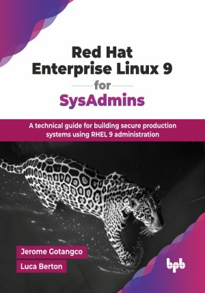

# Red Hat Enterprise Linux 9 for SysAdmins

A technical guide for building secure production systems using RHEL 9 administration.

This is the repository for [Red Hat Enterprise Linux 9 for SysAdmins
](https://bpbonline.com/products/red-hat-enterprise-linux-9-for-sysadmins?variant=44469303869640),published by BPB Publications.

## About the Book
Red Hat Enterprise Linux (RHEL) is the de facto standard for Linux in the enterprise and the latest version (RHEL 9) offers the best of open-source software to date with the stability and security provided by the biggest name in open-source, Red Hat.

The book begins with an introduction to RHEL 9's features, architecture, and its role in the open-source ecosystem, including comparisons with Fedora and CentOS. It then delves into practical aspects of RHEL 9 setup, covering installation methods, cloud deployments on AWS, Azure, and GCP, and subscription management. The book further explores application deployment and management, including software repositories, the GNOME desktop environment, infrastructure services, virtualization, containerization with Podman, networking, file storage, and DevOps pipelines. Finally, it addresses critical security and monitoring aspects, detailing security hardening techniques, capacity planning, log analysis, system auditing and an introduction to AI/ML frameworks on RHEL 9.

Whether you are learning the ropes on Linux, had some experience on running a previous RHEL system, or even have managed Linux clusters, Red Hat Enterprise Linux 9 for SysAdmins is a handy reference that would boost your knowledge and experience with the latest version of RHEL 9.

## What You Will Learn
• Master fundamental and advanced RHEL 9 administration, including system environment configuration, desktop customization, and automated task management.

• Implement RHEL 9 security hardening with secure access controls and subscription management, ensuring comprehensive enterprise protection.

• Configure enterprise infrastructure with database applications and virtual machines, optimized for high-performance workload delivery.

• Develop containerized applications using Podman, integrating RHEL and AI capabilities for automated deployment and orchestration.

• Build development platforms in RHEL 9 with DevOps practices and automated workflows for efficient application lifecycle management.
